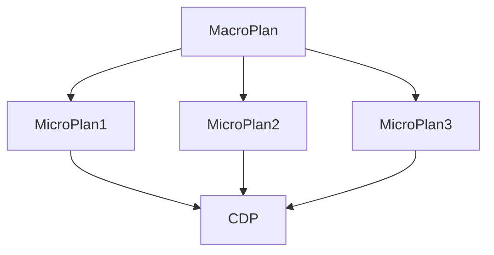
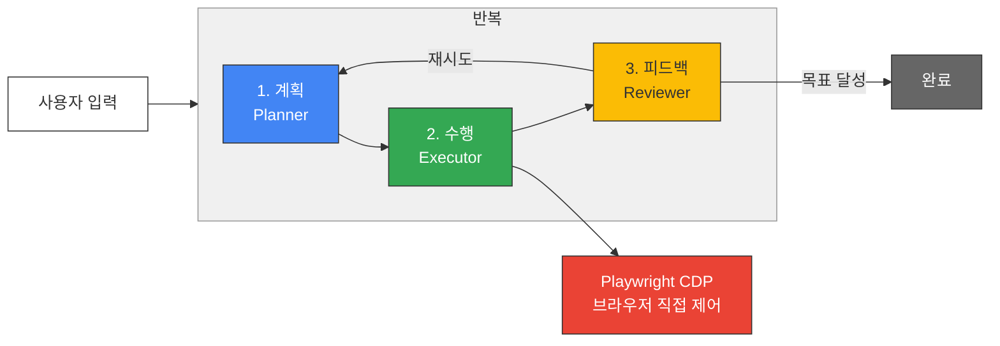

## 아키텍처

**Frontend → js가지고 채팅, todo만드는 부분 → 바이브코딩으로 할 예정**

**Langraph를 사용한 상태머신 → Python Backend**

### Macro Planner 거시 목표 Anchor 정하고, Anchor를 위한 Step을 수립

Plan 노드는 전체 워크플로우의 방향을 결정하는 내비게이션 역할을 합니다. 구체적인 화면 요소의 위치나 구조(DOM)에 의존하지 않고, 추상적이고 거시적인 목표 단위로 작업을 분할합니다.

- 역할 및 동작:
    - 사용자의 최초 자연어 명령을 분석하여 단계별 태스크 리스트(예: 1. 로그인, 2. 목적지 검색, 3. 결제 승인)를 생성합니다.
    - 롤링 웨이브 계획법을 적용하여 한 번에 2~3단계의 단기 계획만 수립하고, 상황이 변하면 기존 계획을 수정(Replanning)합니다.
    - 각 태스크마다 담당자(Agent 또는 Human)를 지정하고, 해당 태스크가 완료되었음을 판단할 수 있는 기대 결과(Expected Outcome)를 텍스트로 명시합니다.



```python
class MacroPlan:
	anchor:str # final 불변으로 고정
	state:Enum[WAITING, RUNNING, REVIEWING, FINISH]
	micro_plans:List[MicroPlan] # 이게 빠르게 생각이 안나면, 나는 그냥 쉼 청년이 되겠구나
	temp_plan_index:int
	
	
def plan_agent(user_message:str) -> MacroPlan:
	do_something()
	return MacroPlan(**)
```

### Micro Planner 미시 목표 → → Browser use를 사용해서 하는 식으로 차용 (DOM tree 파싱한다음에, 번호 매기고, 실제 어떤 DOM tree 누를지 정하는 세부 계획 수립)

Executor 노드는 Plan이 하달한 '현재 태스크'를 완수하기 위해 실제 화면의 어떤 요소를 조작할지 결정하는 전술적 실행자

- 역할 및 동작:
    - 전체 계획은 무시하고, 오직 배정받은 단일 태스크와 현재 화면의 상태(스크린샷 및 압축된 DOM 트리)에만 집중합니다.
    - 화면을 분석하여 목표 달성에 필요한 구체적인 행동(클릭, 타이핑, 스크롤 등)과 대상 요소의 고유 인덱스 번호를 매핑하여 JSON 형태의 도구 호출(Tool Call) 데이터를 생성합니다.
    - 예상치 못한 팝업이나 오류 메세지가 화면에 나타나면, 강제로 행동을 취하지 않고 예외 상태를 반환하여 Plan 노드가 재계획을 하도록 유도합니다.

```python
from bs4 import Selector

class AbstactExecutionResult:
	pass
	
class MicroPlan:
	anchor: str
	target_dom_element_selector:Selector #document.querySelector("#main > div > div > div.whenContentEditable > div > div:nth-child(6) > div > div:nth-child(8) > div > div:nth-child(2)")
	action: Enum[Click, Type, somthing]
	status: Enum[WAITING, RUNNING, REVIEWING, STOPPED, FINISH] # 운영체제 공부하세요
	executor:	Enum[Agent, Human]
	
def micro_plan_agent(macro_plan:MacroPlan) -> AbstactExecutionResult:
	micro_plan = do_something(macro_plan)
	execution_result = cdp_executor(micro_plan)
	return micro_plan
```

### CDP Executor (Real DOM executor) 실행자

chrome api를 호출만 하는 단순한 존재 agent도 아니고 그냥 호출자

```python
class ExecutionResult(): # CDPResult? 
	pass
	
def cdp_executor(micro_plan:MicroPlan) -> ExecutionResult:
	do_something() # CDP 호출
	return ExecutionResult(**)
```

### Reviewer (Strict Validator) Executor가 종료되면, 아니면 부분 실패하면 Reviewer가 개입

Reviewer 노드는 Executor의 행동이 실제로 유효한 결과를 만들어냈는지 객관적으로 평가하는 감사관입니다.

- 역할 및 동작:
    - Executor가 행동을 완료한 직후의 새로운 화면 상태(DOM/스크린샷)와 Plan 노드가 설정해둔 '기대 결과'를 대조합니다.
    - 다음 행동을 절대 스스로 계획하지 않으며, 오직 성공 여부(True/False)와 그 사유만을 판단합니다.
    - 검증을 통과하면 다음 태스크로 진행시키고, 실패하면 Executor에게 재시도를 지시합니다. 특정 횟수 이상 실패 시 작업을 중단시키고 Human 개입이나 Plan 노드의 재계획을 요청합니다.

```python
class ReviewResult():
	pass
	
def reviewer(abstract_excutrion_result:AbstactExecutionResult) -> ReviewResult:
	do_something() # CDP 호출
	return ExecutionResult(**)
```

- [ ]  각 Agent에 대한 인터페이스
- [ ]  최종 인터페이스
- [ ]  아키텍처 mermaid
- [ ]  시나리오

